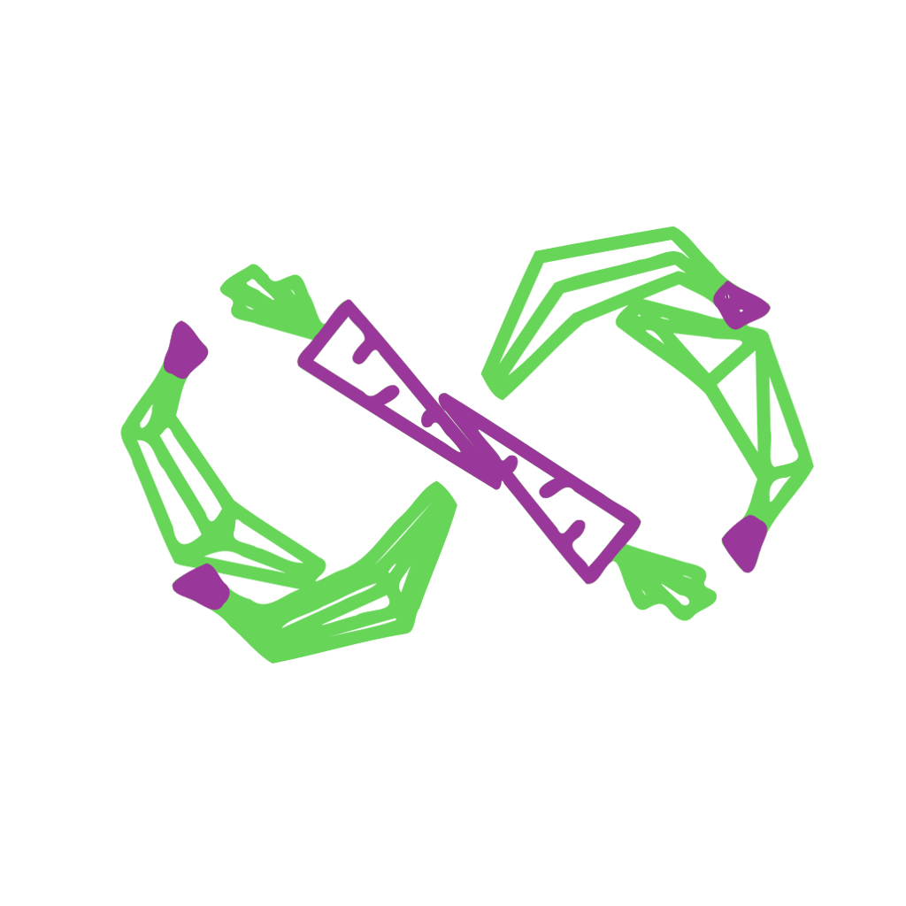

# Restart Your Meal

Game developped for GitHub GameOff 2017.

## Aim of the game

**Aim of the game:** Survive on a desert island. Desert ? Or maybe not. Ghosts from your previous meals may come bother you in your search for food

## Rules

- Eat all food of the level in the limited time, but beware ghosts.

- Each time you eat all the food, you complete a level.

- Each time you complete a level, a new ghost appear.

## Credits

### Code 
[Vincent Reynaert](https://github.com/VincentReynaert), [Nicolas Sobczak](https://nsobczak.github.io/portfolio/)

### Water asset
[Danielzeller](https://github.com/danielzeller/Lowpoly-Water-Unity)

### 2D art
[Vincent Reynaert](https://github.com/VincentReynaert)

### 3D art
[Nicolas Sobczak](https://nsobczak.github.io/portfolio/)

### Animations
[Nicolas Sobczak](https://nsobczak.github.io/portfolio/)

### Music
 - menu: "That's It For Today -Pieces-" by ViRiX Dreamcore (David Mckee) - CC-BY-SA 3.0 license
 - in game: "Green & Gray" by Pugly - CC-BY-SA 3.0 license
